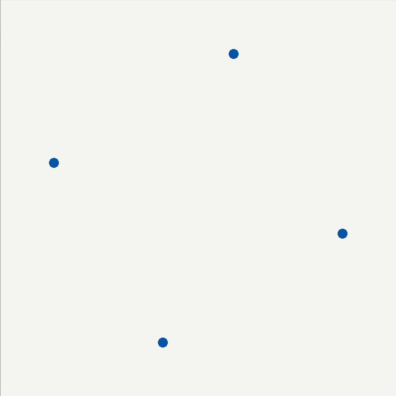
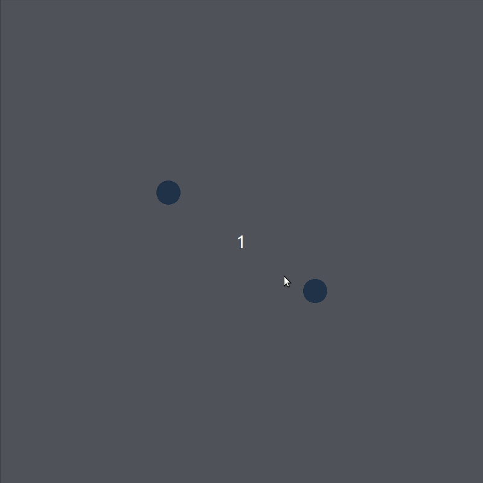
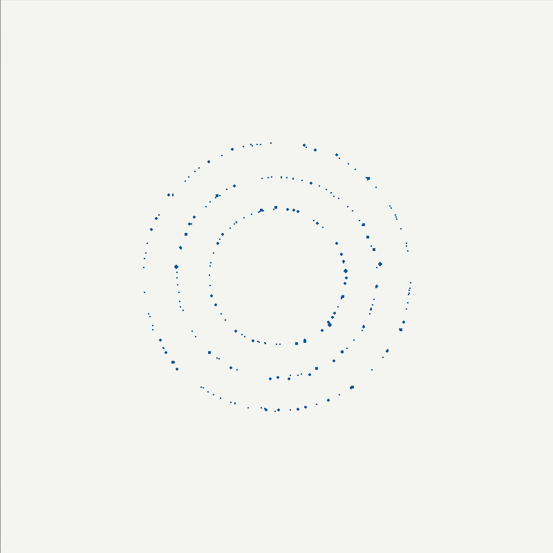
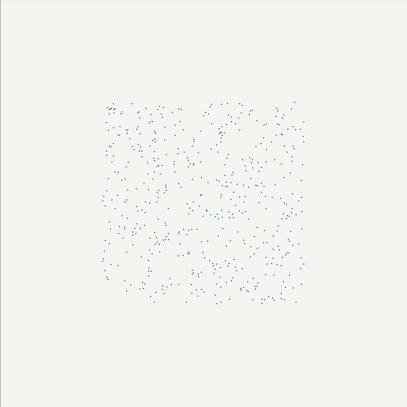

# Particle Simulator
Particle Simulator written in C using raylib.

## Allows for inserting new particles through drawing

## A stable 4 star orbiting scenario 

## A stable 2 star orbiting scenario being interrupted

## An interesting result of opposing orbiting rings 

## Random particles

